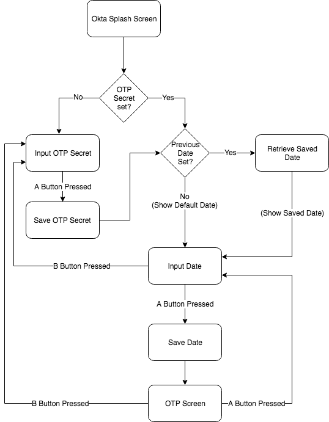
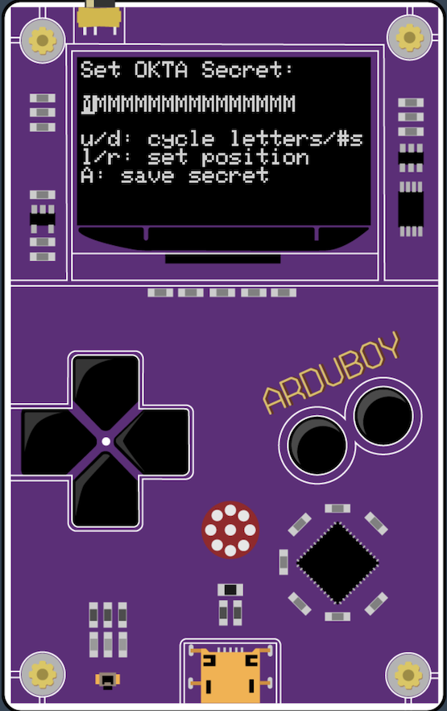
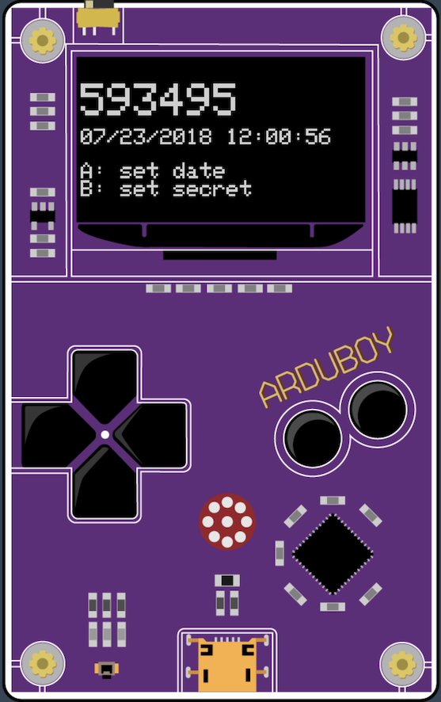

## OktaArduToken

This project turns an [ArduBoy](https://arduboy.com/) credit card size game machine into a 
[TOTP](https://tools.ietf.org/html/rfc6238) token for use with the 
[Okta Verify OTP](https://help.okta.com/en/prod/Content/Topics/Mobile/Okta_Verify_Using.htm) service.


Impractical you say? Well, yeah. 

TOTP relies on a shared secret and an accurate clock.
The biggest challenge is that when you turn off an ArduBoy, it's *really* off. 
There's no realtime clock that continues to run when the ArduBoy is off. We take this for granted on our computers or
mobile devices that either have hardware to keep the clock running, have the ability to automatically set the time
over a network on boot or both. Not so with the ArduBoy! In order to really use this as your go to TOTP device, you
need to keep it on and charge it before it dies.

What this application does to mitigate this is (a) saves the secret and (b) saves the last date and time set on boot. The next
time you turn on the ArduBoy, it checks to see if a secret has been set. If so, it goes directly to setting the date and time.
On the date and time setting screen, it starts with the last set date and time to make it easier to set.



This is a fun way to learn a little about TOTP and see it working against a real [Okta organization](https://developer.okta.com).

In "real life", you'll want to use the Okta Verify mobile app 
(available on [iOS](https://itunes.apple.com/us/app/okta-verify/id490179405?mt=8) and 
[Android](https://play.google.com/store/apps/details?id=com.okta.android.auth&hl=en_US)). There's a lot less manual labor involved.

## Up and Running

If you have an ArduBoy and want to see the app running, you can install the latest binary `.hex` file directly. 

You can also drop the `.hex` file right onto the [ProjectABE](https://felipemanga.github.io/ProjectABE/) ArduBoy emulator site to see it 
in action without having an actual ArduBoy yourself. *NOTE:* ProjectABE does not have the ability to save data to the 
[EEPROM](https://www.arduino.cc/en/Reference/EEPROM). So, if you restart the application there, you'll need to re-set both the shared 
secret and the time.

The easiest way to install OktaArduToken onto an actual ArduBoy is to use install the 
[Arduino IDE](https://www.arduino.cc/en/Main/Software). This allows you to both edit and upload the source as well as providing the 
command line tool, `avrdude`, to upload binaries.

Here's an example install command using `avrdude` on Mac:

```
/Applications/Arduino.app/Contents/Java/hardware/tools/avr/bin/avrdude -v \
-C /Applications/Arduino.app/Contents/Java/hardware/tools/avr/etc/avrdude.conf \
-p atmega32u4 \
-c avr109 \
-P /dev/cu.usbmodem1411 \
-U flash:w:<path to OktaArduToken project>/OktaArduToken.hex
```

*Note:* The `-p` parameter specifies the ArduBoy part number and the `-c` parameter specifies the ArduBoy programmer type.
The `-P` parameter will be different on your Mac. You can see the list of available serial ports by using this command:

```
ls -la /dev/cu.*
```

You're looking for the entry that contains `usbmodem` in it.

## Source and Dependencies

If you want to work with the source code in the Arduino IDE, compile it, and upload it to you ArduBoy, you'll need to install
a few libraries. For each of these, navigate to: `Sketch -> Include Library -> Manage Libraries`.

You'll need:

* [Arduboy2](https://github.com/MLXXXp/Arduboy2) - An alternative library for the Arduboy miniature game system
* [swRTC](http://www.leonardomiliani.com/en/2011/swrtc-un-orologio-in-tempo-reale-via-software/) - A software Real-Time Clock
* [TOTP-Arduino](https://github.com/lucadentella/TOTP-Arduino) - Library to generate Time-based One-Time Passwords
* [Base32](https://github.com/NetRat/Base32) - a library for Arduino boards to encode strings into and decode strings from Base32

The `Base32` library is the only one that you can't install via the library manager in Arduino IDE. It's easy enough to install
by cloning the github repository and copy the files to your local Arduino IDE libraries folder. On mac, the default is:

```
~/Documents/Arduino/libraries/
```

If all your libraries are in place, you can navigate to: `File -> Open...` in the Arduino IDE and choose the `OktaArduToken.ino` file.
You should be able to navigate to: `Sketch -> Verify/Compile` to compile the code. If you get any errors, make sure that all the
above libraries are installed.

## OktaArduToken Navigation

OktaArduToken is unique among TOTP examples for Arduino or ArduBoy in that it has an interface to set the shared secret and to set the
date and time. Most examples require you to hardcode the secret into the source code before uploading.

With a total of 6 buttons, the interface to set the shared secret and the date and time may remind you of a '90s era flip phone ;)

### Set Shared Secret

When you first launch that app, you'll see the shared secret setting screen:



Okta Verify uses a 16-byte Base32 encoded string for the shared secret. Initially, this is shown as 16 `M`s. You can use the up and down
buttons to navigate around the set of capital letters and the numbers from 0 - 9. You can use the left and right buttons to move
positions amongst the available 16 characters.

The interface automatically wraps. That is, hitting the right button when you're on the 16th character moves the cursor back to the
1st character. Hitting the left button when you're on the 1st character moves the cursor to the 16th character. Likewise, hitting
the up button when `9` is showing, will change that character to `A`. Hitting the down arrow when `A` is showing, will change that
character to `9` (it goes `A`-`Z` and then `0`-`9`).

When the shared secret is set, press the `A` button to move on to the date and time setting screen.

*NOTE:* Watch the [Okta Developer Blog](https://developer.okta.com/blog) for a post on setting up Okta to enroll and enforce MFA and 
use the OktaArduToken.

### Set Date and Time

Once you've saved the shared secret, you'll see the date and time setting screen:


You can use the up and down arrows to change the numbers for each part of the date and time. You can use the right and left buttons
to change positions on the date and time interface. The interface will automatically skip over separators and will automatically
wrap.

Once the date and time are set, press the `A` button to move on to the TOTP screen. *NOTE:* Precision is important, so it is
recommended that you set the time ahead by 10 seconds, watch a clock with a seconds counter and hit the `A` button the
moment at which the times match.

You can press the `B` button to return to the shared secret screen.

*NOTE:* There is currently NO error checking of any kind. That is, if you put in an invalid date and/or time, you will get 
unexpected results.

### The TOTP Display

Once the shared secret and date and time are set, you see the TOTP screen. At the top of the screen, in a large font, you see the
current passcode. This passcode changes every 30 seconds. Below the passcode, you see the full date and time which updates every
second.



Press the `A` button to return to the set date and time screen. Press the `B` button to return to the set shared secret screen.

*NOTE:* Watch the [Okta Developer Blog](https://developer.okta.com/blog) for a post on setting up Okta to enroll and enforce MFA and 
use the OktaArduToken.

Here's the OktaArduToken side-by-side with the Okta Verify mobile app:


